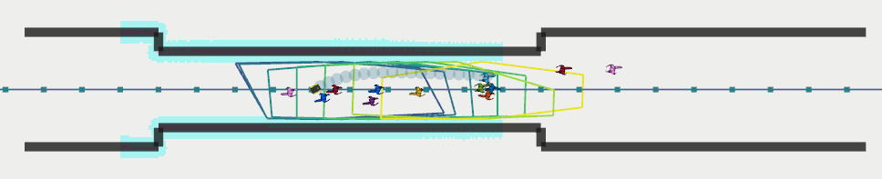
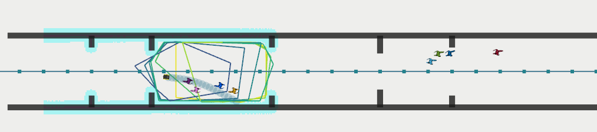
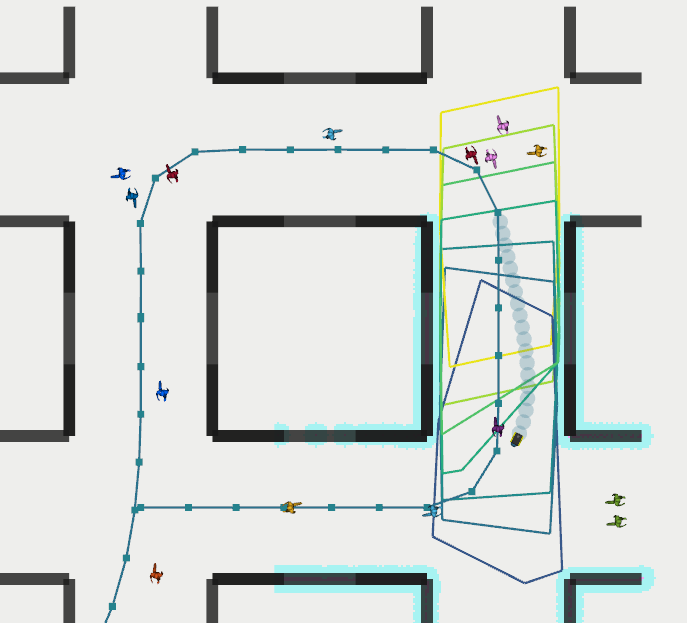
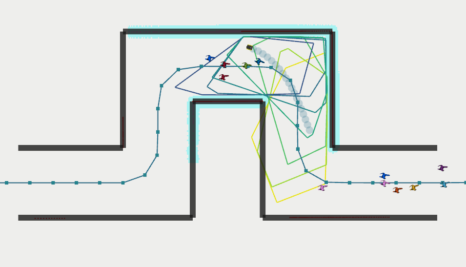

# Jackal Social Navigation Simulator

### Scenario definition
The scenario is defined in xml format as demonstrated in the example below.

**Static Obstacles** are added with various commands, including 

- `hallway_x` (hallway in x direction)
- `hallway_y` (hallway in x direction)
- `intersection` (four way intersection)
- `wall_off` (close off parts of a hallway)
- `obstacle_size` (a single wall at x,y with size length_x, length_y)

Note that hallways are shortened by half the width to make specification simpler.

**Pedestrians**  are defined by a random spawn range and usually an offset for where the goal can be compared to the start range. The line `<random_pedestrians value="12"/>` defines the number of pedestrians at any time. 

**Reference Path** is set with a set of waypoints (x, y, orientation). A clothoid will be fit in `roadmap` that is used in the MPC to compute cubic splines. Defining the waypoints as the end points of each hallway usually leads to good paths.

```xml
<?xml version="1.0" encoding="UTF-8"?>
<tag type="social"/>

<!--Static obstacles-->
<hallway_x x="0" y="0" length="15.0" width="6.0"/>
<wall_off x="15" y="0" width="6.0" left="0" up="0" right="1" down="1"/>
<hallway_y x="15" y="0" length="10.0" width="6.0"/>
<wall_off x="15" y="10" width="6.0" left="1" up="1" right="0" down="0"/>
<hallway_x x="15" y="10" length="12.0" width="6.0"/>
<wall_off x="27" y="10" width="6.0" left="0" up="1" right="1" down="0"/>
<hallway_y x="27" y="10" length="-10.0" width="6.0"/>
<wall_off x="27" y="0" width="6.0" left="1" up="0" right="0" down="1"/>
<hallway_x x="27" y="0" length="15.0" width="6.0"/>

<!-- Pedestrians -->
<random>
    <range_x min="25" max="27"/>
    <range_y min="9" max="11"/>
    <range_v min="1.14" max="1.66"/>
    <goal_offset x="-12" y="0"/>   
</random>
<random>
    <range_x min="40" max="45"/>
    <range_y min="-1" max="1"/>
    <range_v min="1.14" max="1.66"/>
    <goal_offset x="-15" y="0"/>   
</random>
<random_pedestrians value="12"/>

<!-- Roadmap -->
<way>
  <nd x="-10" y="0" theta="0"/>
  <nd x="12" y="0" theta="0"/>
  <nd x="15" y="3" theta="1.5708"/>
  <nd x="15" y="7" theta="1.5708"/>
  <nd x="18" y="10" theta="0"/>
  <nd x="24" y="10" theta="0"/>
  <nd x="27" y="7" theta="-1.5708"/>
  <nd x="27" y="3" theta="-1.5708"/>
  <nd x="30" y="0" theta="0"/>
  <nd x="40" y="0" theta="0"/>
  <lane type="road" width="4." two_way="1"/>
</way>
```

### Current Scenarios
Some example environments are visualized below:

**Corridor:**

 

**Corridor with doors:**

 

**Square Corridor:**

 

**S-Shaped Corridor:**

 |
